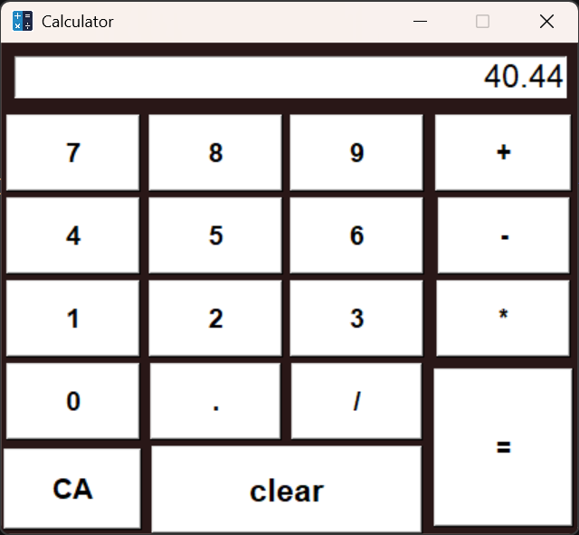
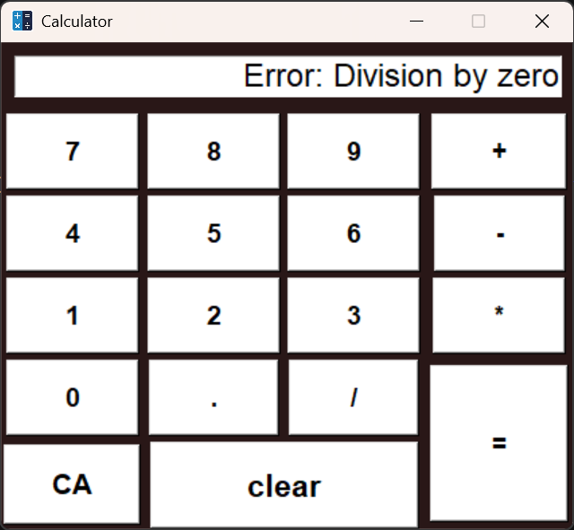

# GUI-Calculator

## 🧮 GUI Calculator (Python Tkinter)

A beginner-friendly desktop calculator built using Python and Tkinter. This project demonstrates the fundamentals of GUI development, event handling, and structuring a Python application.

## ✨ Features

- Clean and simple GUI
- Basic arithmetic operations:
  - Addition
  - Subtraction
  - Multiplication
  - Division
- Clear button to reset calculations
- Lightweight desktop app

## 🖥️ Preview

### Integer Type Calculations


### Floating Point Calculations


### Error Handling


## 🛠️ Built With

- **Python 🐍**
- **Tkinter** (Python GUI Library)

## 🚀 Getting Started

Follow these steps to run the project on your computer:

### 1️⃣ Clone the Repository
```bash
git clone https://github.com/MohanSai0233/GUI-Calculator.git
```

### 2️⃣ Open the Project Folder
```bash
cd GUI-Calculator
```

### 3️⃣ Run the App
```bash
python calculator.py
```

## 📚 What I Learned From This Project

- Basics of Tkinter GUI development
- Handling button click events
- Managing user input and calculations
- Structuring a small Python project
- Using Git & GitHub for version control

## 🎯 Future Improvements

- Add keyboard input support
- Enhance the GUI with modern styling
- Include advanced mathematical operations (e.g., square root, exponentiation)
- Add a history feature to track previous calculations

## 👤 Author

- **Name**: MOHAN SAI
- **GitHub**: https://github.com/MohanSai0233
- **LinkedIn**: https://linkedin.com/in/mohan-sai-manicheri-b78970374

Feel free to connect or explore more of my projects!